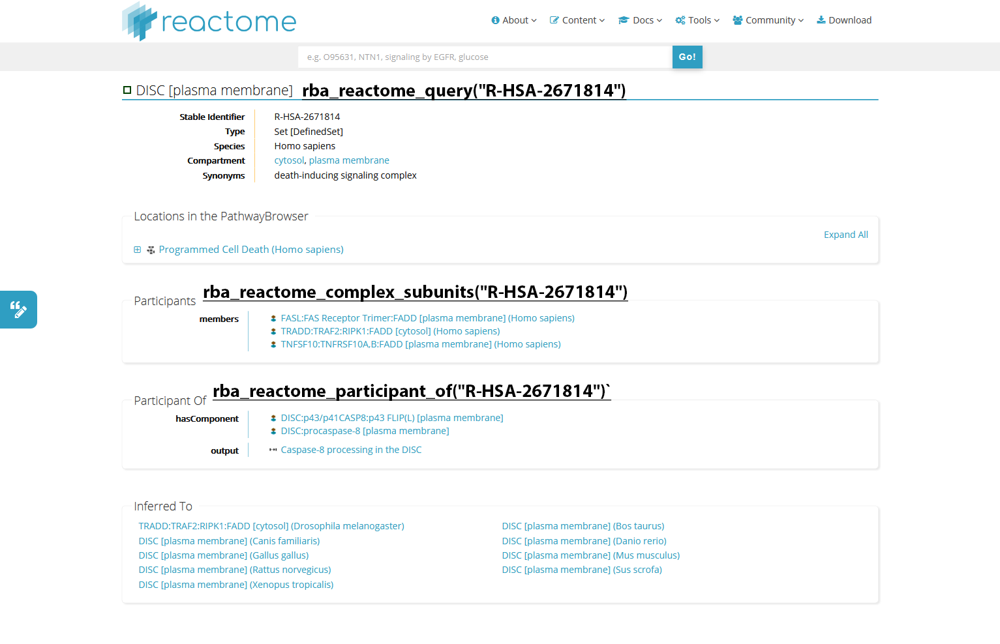
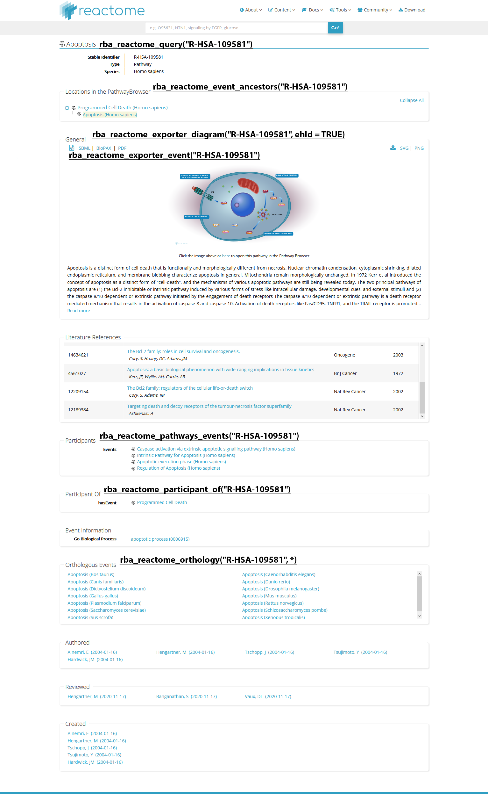
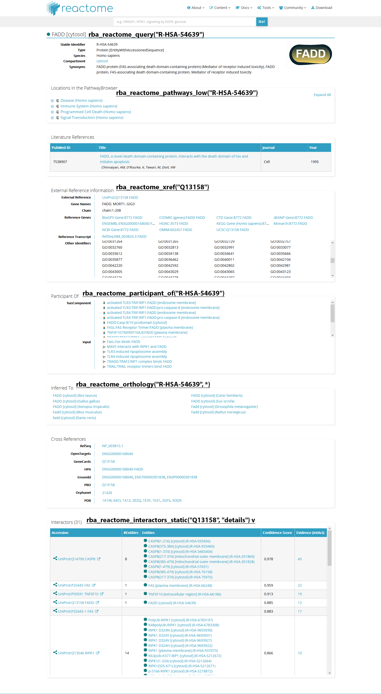
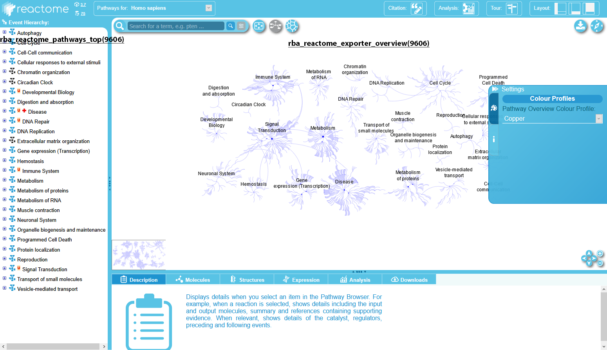

```{r message=FALSE, include=FALSE, results="hide", setup, echo=FALSE}
knitr::opts_chunk$set(echo = TRUE,
                      message = FALSE,
                      warning = FALSE,
                      tidy = FALSE,
                      cache = FALSE,
                      dev = "png",
                      collapse = TRUE,
                      comment = "#>",
                      eval = TRUE
)
library(rbioapi)
rba_options(timeout = 600)
```

------------------------------------------------------------------------

## Introduction {#introduction .heading2}

Directly quoting from Reactome:

> REACTOME is an open-source, open access, manually curated and peer-reviewed pathway database. Our goal is to provide intuitive bioinformatics tools for the visualization, interpretation and analysis of pathway knowledge to support basic and clinical research, genome analysis, modeling, systems biology and education. Founded in 2003, the Reactome project is led by Lincoln Stein of [OICR](http://oicr.on.ca/), Peter D'Eustachio of [NYULMC](http://nyulangone.org/), Henning Hermjakob of [EMBL-EBI](http://www.ebi.ac.uk/), and Guanming Wu of [OHSU](http://www.ohsu.edu/).
>
> (source: <https://reactome.org/what-is-reactome>)

Reactome provides two RESTful API services: Reactome content services and Reactome analysis services. In rbioapi, the naming schema is that any function that belongs to analysis services starts with rba_reactome_analysis\* . Other rba_reactome\_\* functions without the 'analysis' infix correspond to content services API.

Before continuing reading this article, it is a good idea to read [Reactome Data Model](https://reactome.org/documentation/data-model) page.

------------------------------------------------------------------------

## Reactome analysis services {#reactome-analysis-services .heading2}

This section mostly revolves around `rba_reactome_analysis()` function. So, naturally, we will start with that. As explained in the function's manual, you have considerable freedom in providing the main input for this function; You can provide an R object (as data frame, matrix, or simple vector), a URL, or a local file path. Note that the type of analysis will be decided based on whether your input is 1-dimensional or 2-dimensional. This has been explained in detail in the manual of `rba_reactome_analysis()`, so refer to that for more information.\
`rba_reactome_analysis()` is the API equivalent of Reactome's [analyse gene list](https://reactome.org/PathwayBrowser/#TOOL=AT) tool. You can see that the function's arguments correspond to what would you choose in the webpage's wizard.

```{r rba_reactome_analysis}
## 1 we create a simple vector with our genes
genes = c("p53", "BRCA1", "cdk2", "Q99835", "CDC42", "CDK1", "KIF23", "PLK1", "RAC2", "RACGAP1", "RHOA", "RHOB", "MSL1", "PHF21A", "INSR", "JADE2", "P2RX7", "CCDC101", "PPM1B", "ANAPC16", "CDH8", "HSPA1L", "CUL2", "ZNF302", "CUX1", "CYTH2", "SEC22C", "EIF4E3", "ROBO2", "CXXC1", "LINC01314", "ATP5F1")

## 2 We call reactome analysis with the default parameters
analyzed = rba_reactome_analysis(input = genes,
                                 projection = TRUE,
                                 p_value = 0.01)

## 3 As always, we use str() to inspect the resutls
str(analyzed, 1)

## 4 Note that in the summary element:
### 4.a because we provided a simple vector, the analysis type was: over-representation
### 4.b You need the token for other rba_reactome_analysis_* functions
str(analyzed$summary)

## 5 Analsis results are in the pathways data frame:
```

```{r analysis_results, echo=FALSE}
DT::datatable(data = jsonlite::flatten(analyzed$pathways),
              style = "bootstrap4",
              options = list(scrollX = TRUE, 
                             paging = TRUE,
                             fixedHeader = TRUE,
                             keys = TRUE,
                             pageLength = 5))

```

As mentioned, some of `rba_reactome_analysis()`'s arguments correspond to the wizard of [analyse gene list](https://reactome.org/PathwayBrowser/#TOOL=AT) tool; Other arguments corresponds to the contents of "Filter your results" tab ({#reactome_analysis_filter_your_results .img_button width="15"}) in the results page.

Having the analysis's token, you can retrieve the analysis results in many formats using `rba_reactome_analysis_pdf()` and `rba_reactome_analysis_download()`:

```{r rba_reactome_analysis_pdf/download, eval=FALSE}
# download a full pdf report
rba_reactome_analysis_pdf(token = analyzed$summary$token,
                          species = 9606)
# download the result in compressed json.gz format
rba_reactome_analysis_download(token = analyzed$summary$token,
                               request = "results",
                               save_to = "reactome_results.json")
```

Your token is only guaranteed to be stored for 7 days. After that, you can upload the JSON file you have downloaded using `rba_reactome_analysis_download` and get a token for that:

```{r rba_reactome_analysis_import, eval=FALSE}
re_uploaded = rba_reactome_analysis_import(input = "reactome_results.json")
```

## See also in Functions' manuals {#analysis_see-also-in-functions-manuals .heading3}

Some rbioapi Reactome analysis functions were not covered in this vignette, be sure to check their manuals:

-   `rba_reactome_analysis_mapping()`

-   `rba_reactome_analysis_species()`

-   `rba_reactome_analysis_token()`

------------------------------------------------------------------------

## Reactome contents services {#reactome-contents-services .heading2}

rbioapi Reactome content services functions are those starting with rba_reactome\_\* but without "\_analysis" infix. These function cover what you can do with objects in Reactome knowledge-base. In simpler terms, most -but not all of them- correspond to what you can find in [Reactome Pathway Browser](https://reactome.org/PathwayBrowser/ "Reactome Pathway Browser") and [search results](https://reactome.org/content/query?q=apoptosis&species=Homo+sapiens "Search results for apoptosis"). (e.g. a [pathway](https://reactome.org/content/detail/R-HSA-109581 "Apoptosis Homo sapiens"), a [reaction](https://reactome.org/content/detail/R-HSA-202939 "Caspase-mediated cleavage of E-Cadherin"), a [physical Entity](https://reactome.org/content/detail/R-HSA-350870 "Caspase-3 [cytosol]"), etc.)

### Retrieve any object from Reactome knowledge-base

Using `rba_reactome_query()`, you can retrieve any object from Reactome knowledge-base. In simpler terms, here what I mean by object is roughly anything that Reactome associated and ID to it. This can range from a person's entry to proteins, reactions, pathways, species, and many more! You can explore [Reactome's data schema](https://reactome.org/content/schema/DatabaseObject "Graph Database :: Data Schema") to what Reactome knowledge-base objects are and how they are organized. Here are some examples, note that you are not limited to only one ID per query. You can use a vector of inputs, the only limitation is that when you provide more than one ID, you cannot have `enhanced = TRUE`.

```{r rba_reactome_query_ex1, eval=FALSE}

## 1 query a pathway Entry
pathway = rba_reactome_query(ids = "R-HSA-109581", enhanced = TRUE)
## 2 As always we use str() to inspect the output's structure
str(pathway, 2)
## 3 You can compare it with the webpage of R-HSA-202939 entry:
# https://reactome.org/content/detail/R-HSA-202939
```

```{r rba_reactome_query_ex2, eval=FALSE}

## 1 query a protein Entry
protein = rba_reactome_query(ids = 66247, enhanced = TRUE)
## 2 As always we use str() to inspect the output's structure
str(protein, 2)
## 3 You can compare it with the webpage of R-HSA-202939 entry:
# https://reactome.org/content/detail/R-HSA-202939

```

### Find Cross-Reference IDs in Reactome

As you can see in the second example usage of we used Reactome's dbID `66247` to query CD40 protein. How did we obtain that in the first place? You can use `rba_reactome_xref` to map any cross-reference (external) IDs to Reactome IDs.

```{r rba_reactome_xref, eval=FALSE}

# 1 We provide HGNC ID to find what is the corresponding database ID in Reactome
xref_protein = rba_reactome_xref("CD40")
## 2 As always use str() to inspect the output's structure
str(xref_protein, 2)
```

### Map Cross-Reference IDs to Reactome

While we are at the cross-reference topic, here is another useful resource. Using `rba_reactome_mapping` you can find the Reactome pathways or reactions which include your external ID:

```{r xref_mapping}
## 1 Again, consider CD40 protein:
xref_mapping = rba_reactome_mapping(id = "CD40",
                                    resource = "hgnc",
                                    map_to = "pathways")
```

```{r xref_mapping_df, echo=FALSE}
DT::datatable(data = xref_mapping,
              style = "bootstrap4",
              options = list(scrollX = TRUE, 
                             paging = TRUE,
                             fixedHeader = TRUE,
                             keys = TRUE,
                             pageLength = 10))
```

------------------------------------------------------------------------

## See also in Functions' manuals {#see-also-in-functions-manuals .heading2}

There are still more rbioapi f Reactome content functions that were not covered in this vignette. Here is a brief overview, refer to the functions' manual for detailed guides and examples.

### Retrieve Reactome Database information

-   `rba_reactome_version()`: Return current Reactome version

-   `rba_reactome_diseases()`: Retrieve a list of disease annotated in Reactome.

-   `rba_reactome_species()`: Retrieve a list of species annotated in Reactome.

### General Mapping/Querying

-   `rba_reactome_query()`

-   `rba_reactome_mapping()`

-   `rba_reactome_xref()`

### Things you can do with a Entities

-   `reactome_complex_list()`: Get a list of complexes that have your molecule in them.

-   `rba_reactome_complex_subunits()`: Get the list of subunits in your complex

-   `rba_reactome_participant_of()`: Get a list of Reactome sets and complexes that your entity (event, molecule, reaction, pathway etc.) is a participant in them.

-   `rba_reactome_entity_other_forms()`

### Things you can do with Events

-   `rba_reactome_event_ancestors()`

-   `rba_reactome_participants()`

-   `rba_reactome_pathways_events()`

-   `rba_reactome_event_ancestors()`

-   `rba_reactome_orthology()`

-   `rba_reactome_event_hierarchy()`: Retrieve full event hierarchy of an species.

### Pathways

-   `rba_reactome_pathways_low()`

-   `rba_reactome_pathways_events()`

-   `rba_reactome_pathways_top()`

### Interactors

-   `rba_reactome_interactors_psicquic()`

-   `rba_reactome_interactors_static()`

### People

-   `rba_reactome_people_name()`

-   `rba_reactome_people_id()`

### Export diagrams and events

-   `rba_reactome_exporter_diagram()`

-   `rba_reactome_exporter_overview()`

-   `rba_reactome_exporter_reaction()`

-   `rba_reactome_exporter_event()`

------------------------------------------------------------------------

## Some visual examples {#some-visual-examples .heading2}

Below are some example screenshots from different pages in Reactome's website along with corresponding rbioapi function calls.

+:------------------------------------------------------------------------------------------------------------------------------------:+:------------------------------------------------------------------------------------------------------------------------------------------------:+:------------------------------------------------------------------------------------------------------------------------------------:+:----------------------------------------------------------------------------------------------------------------------------:+
| Complex                                                                                                                              | Pathway/Event                                                                                                                                    | Protein                                                                                                                              | Species overview                                                                                                             |
+--------------------------------------------------------------------------------------------------------------------------------------+--------------------------------------------------------------------------------------------------------------------------------------------------+--------------------------------------------------------------------------------------------------------------------------------------+------------------------------------------------------------------------------------------------------------------------------+
| [](html_files/reactome_complex.png) | [](html_files/reactome_pathway.png) | [](html_files/reactome_protein.png) | [](html_files/reactome_species.png) |
+--------------------------------------------------------------------------------------------------------------------------------------+--------------------------------------------------------------------------------------------------------------------------------------------------+--------------------------------------------------------------------------------------------------------------------------------------+------------------------------------------------------------------------------------------------------------------------------+

------------------------------------------------------------------------

## Session info {#session-info .heading2}

```{r sessionInfo, echo=FALSE}
sessionInfo()
```

